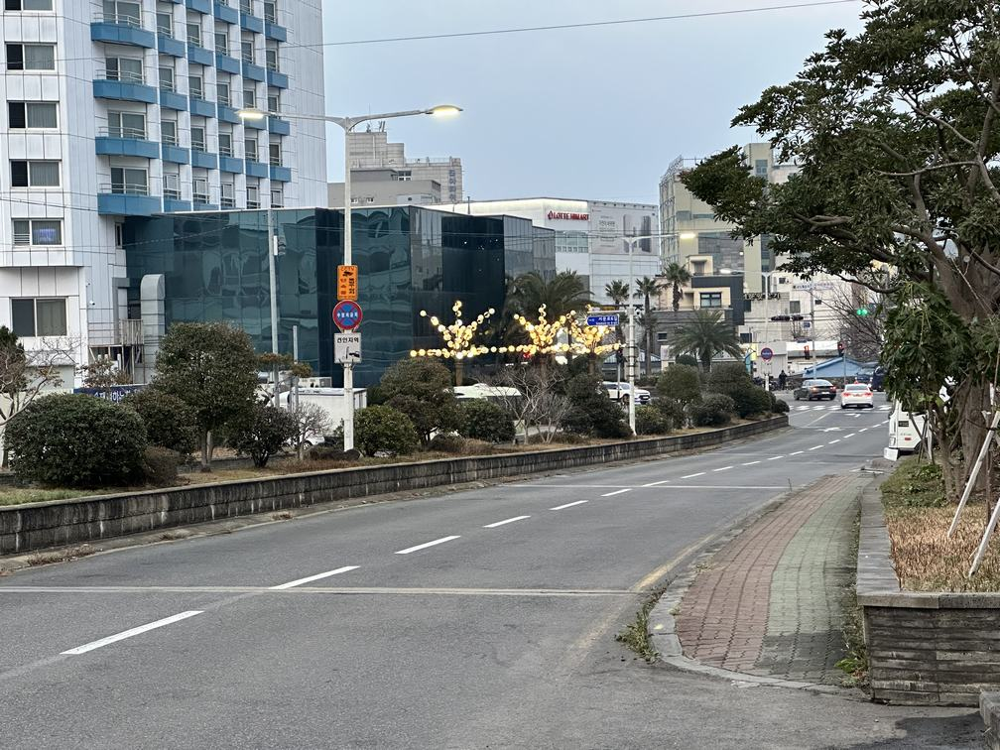
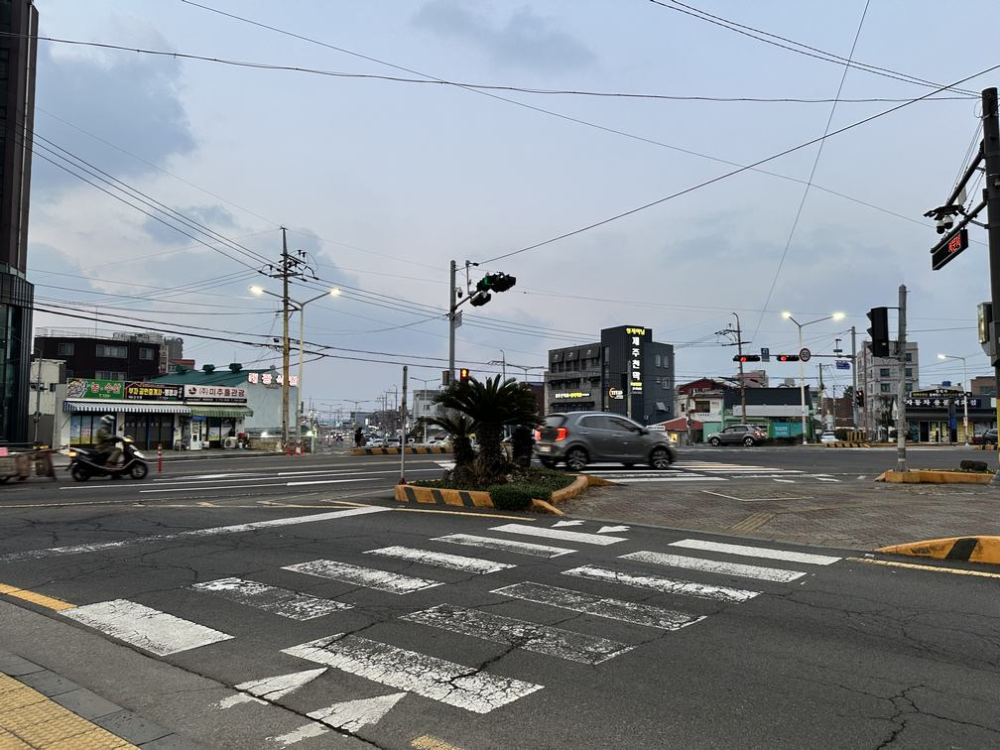

## 写在开始之前

2024年的2月2号的晚上19:48，随着最后一次submit的点击，我们提交了我们最后一个版本的论文。三分钟后，邮箱中收到了ICML发来的确认邮件。

希望一切顺利。如果被接受的话，这是无疑一个令人兴奋的消息。不过我也许不会太激动。因为是否“成功”，对我来说好像也没那么重要。如果半年后这个博客真的有读者，而读者又感兴趣的话，请联系我，我非常愿意在未来将最新的进展更新在这里。

话说回来，这半年六个月的时间，所收获的体验远比我想象的多。虽然标题是“科研”，但研究生**申请**这件事儿这段经历里从未缺席。

有时候不得不感叹生活的不确定性，拥抱这种不确定性有的时候让我感到沮丧，有时候又带来惊喜。这半年就像是“大学生活补全计划”。结束了繁重的三年卷狗生活，没有迎来一个轻松的大四，倒是迎来的充满新鲜事物的大四。就如同《折叠北京》中的设定，我像是走入了大学世界的未知部分，这个世界与过去三年的生活毫无交集。我有了新鲜的见闻、感受了全新的情感、经历了难忘的故事，接下来讲述的这段经历就在其中。应觉得感激，我的体验称得上是天时地利人和。除了应当觉得感激，这半年因为申请也快应激了。无疑，这半年是艰辛、焦虑、有苦有乐的。

把体验本身当作我的目标的时候，会觉得一切都有意思、有价值，想去追寻。这的确不是苦中作乐。

*另外，图文无关。*

## Prologue: 为什么尝试参与本科研究

直言不讳的说，当时加入王老师课题组的主要动力，当然还有再往前在学术导师那的“科研”的原因，是功利的。我的本科成绩不错，但是除此之外，简历上的其他栏目简直像是一片白纸。

科研经历对于研究生的申请是有利的，这是学子们从来没有质疑过的命题。

申请充满了未知。我突然意识到，申请，这个从前鲜有认真了解的话题将决定我的未来。新的任务，有趣吗？可拉倒吧！对事物的新鲜感在顷刻间转变为倒计时般的焦虑感。未知可以让人好奇，也可以让人感到恐惧。

身处浑浊河水中的溺水者，只有向上的选择。当昏暗的河水中飘过来一条绳索，牢不牢固、应当用多少力量拉扯，这不在考虑之列。如何科学地自救，是上岸者的反思。

我没有学生活动，也没有社会实践的经历，便也只能朝着这个方向努力。话说回来，在计划表上写下“科研经历”，很快被我一笔划掉。这概念是在太抽象，什么是科研，要怎么做，完全没有概念。

---

前辈们的建议是找老师聊天、去旁听组会。看似已经可以按图索骥，但这其实只是打卡式的指南。我找到了教授，说明了我的来意，教授邀请我有空旁听组会。走进会议室，找到一个角落坐下来，接下来要做什么，毫无头绪，“科研”不是一件具体的事情。先前的指导都戛然而止，留下一片空白给我自然发挥。我从书包里掏出笔记本，放在桌面上，听着组会的学生轮流发言，琢磨着要记写什么。

组会上的发言像挨个枪毙一样照着顺序。现在看来不过是每位学生分享一下当前的进度以及下一周的计划，但是在当时的我看来，每个人都不是神情严肃，就是睡眼惺忪，只有一两位好似如鱼得水。

对于我来说是完全听不懂的内容。我试图记下每一个人分享中涉及的话题，也试图记下发言的研究生的名字，不过后来似乎都成了草稿纸上多余的墨迹。导师有时候会打断学生的发言，与他们讨论一些细节的修改建议，得到的回应往往也是“嗯”以及“好的”。我想我应该尽量表现得积极一点，我又试图记下每个人提问的细节，每个人研究的细分领域，想着这样下次找导师聊天的时候，也许可以表现得我听组会很认真的样子。毕竟，除了知道要抱紧导师的大腿，我什么也不知道。

至于这些课题，这些放在Slides里边的公式、名词，我大部分是不懂的，自然也谈不上理解。后来也没有仔细了解，也许是没有足够的兴趣，也许是太懒了，没有动力。听组会，对于大三的我来说，是纯粹的任务。我愿意为了“科研经历”者张门票付出我的努力，但它对于我来说，却也仅仅是一个任务。是不愿意做但是不能不做的事情，只有两个状态：完成与未能完成。

所谓探索，是对外部世界的发现，也是对内心世界的重构。彼时的我，无论是对申请还是对科研的了解都是一片混沌，而对于自己的内心，也鲜有明确的答案，只是自顾自的想着“我应该是什么样的”。坦白说，这样的参与，纯粹是靠我自己推着自己往前；这样的积极性，纯粹仰仗着申请的压力。有时候难免吐槽如此病态的模式，研究生鼓励善于研究的人才，而这些努力变得善于研究的人，却不是为了研究。至少对于我，我还没想清楚。目的与实现路径的错位是会让人感到烦扰的，尤其是像我这样习惯于自我推动的人——总是需要为自己找一个像样点的理由鼓励自己继续前进。

不过生活的忙碌会压榨最后一丝自我思考的空间，这未必是一件坏事。时间屈指可数，只能赶鸭子上架。“我是功利的，功利的就是对的”，这是大三的我内心的答案，但却是说不出口的。也许是担心教授听了之后会有不一样的反应，也许是期待脑子里有另外的答案。

无论如何，大学生活的另一章节拉开了序幕。

## Summer Seminar: 继续像一个学生一样

大三的春季学期对于转专业的我来说是异常忙碌的，被压得喘不过气来。之前找的课题组跟着博士生研究的项目没有丝毫的兴趣，课程也有重复多余的感觉。没有丝毫的获得感，让我感到恼怒，有欲哭无泪之感。不过感谢心善的助教，以及我 *(未来)* 最好的朋友 *(之一)*，我很幸运地在申请季保持了并列第一的位子。

~~回头想来，这可能是很重要的前提。少了一步，也许都是完全不同的故事。~~

暑假假期开始不久，就听闻王老师计划在暑期开展seminar，将会在七月中旬左右开展。与知晓情况的同学聊了几句，三言两语打听到这是一个面向本科学生的seminar。Seminar与讨论班类似，大概形容的话，是一个人数不多的会议，一人来分享，大家就分享的内容展开讨论。想到同坐在座位上的都是和我差不多的学生，我似乎稍微有了点兴趣。

当然功利地说，一方面是因为听说大家都参加过一些seminar，心里有点压力；另一方，申请前最后一个假期，确实也需要做点什么，seminar不失为一个轻松的选择。在seminar上阅读论文，尝试发言，无疑可以填充我空白的简历。巧合的是，许多被吸引过来的同学也有此想法。因此，大家分享的积极性空前地高，我最后和另一位同学合作，阅读了大话题中的一个子领域的一些列文章（其实是四篇），并在seminar上做了分享。

现在回想起来，这个Summer Seminar还是略有Seminar的味道在里面的。尽管台下都是只有半吊子功夫的本科生，但大家的交流活跃、平等。我听得很认真，尽力理解分享人所讲，并尝试着大胆提出我的不理解。交流，是seminar给我带来的感觉。不同于课堂与组会中有着明显权力关系的对话，每周三晚上坐在课室里的这一个多小时是我没体验过的学习形式。大家如同讨论课后习题一样自由交流，但讨论的内容不是课本写死的知识，而是大家都有所不知的。

可惜的是，我还是难以从学生思维中转变，哪怕是这样充满自由氛围的几个星期。我仍把这样的事情当作任务对待。完成任务，在前面的方框打上对勾，便再也不见。完成了我的分享部分后，我开始变得心不在焉起来。虽然我依然挺享受这种交流的氛围，但的确是过了最有热情的阶段。后来的两次seminar，我不在学校只得线上参加，便更加把这件事情抛到脑后了。两组同学的分享，我只照着Slides读过几次，至于文章便无暇光顾了。

不过说来也巧，这些被我忽略的分享中的一篇，在日后居然成为了我研究课题的关键角色。

## Make My Choice: 我在寻找什么，大炖菜

暑假结束后，便是悠闲而又紧张的秋季学期。悠闲是因为这个学期剩下的课比较少，而且不会算到申请的成绩单里；紧张自然是因为简历上的空白依然需要填充。

在Summer Seminar中与与王老师题组的同学相聊甚欢，便决定这学期加入王老师的课题组，尝试进行研究。原来的课题组的博士生师兄，就拜拜了。

王教授是我在大学里见到的最为本科生用心的老师了，目前还没有之一。王老师倒是也直截了当，我参加了两三次小组会之后，便在一次会后我聊聊我这学期的研究计划。

我支支吾吾，还没想好要说什么。其实并我不是不知道如何表达我的想法，而是我心里好像根本没有一个成熟的计划。

---

在我的预期里，也许应当有一个人能为我安排一系列的任务：按部就班地完成，这学期也就顺利结束了。我就是这么随风摇摆的感觉，倘若真问我，我兴许只能搪塞应付几句。所以，挤出来几句毫无逻辑的表述，然后是一阵沉默。很快，我大方承认，我对此一点也不清楚。老师倒是像是早就意料到我反应，先开口了。

出乎意料地，王老师直指我的申请。我还记得老师开头的话：“我觉得我应该很**现实**的和你讨论这个问题。这样你会清楚一点，也是对你好。你进入实验室的时间其实相对来说很晚，已经没有几个月的时间了。”

我其实还蛮惊诧的。本来还觉得和教授聊自己申请的问题有些难以启齿，不知道什么时候才能将话题聊到如何为申请做准备上。我的情况大概是怎么样的，是否可以参与更多课题组的工作，有没有机会发文章……这些问题，我都不知道怎么提出来，竟然一个个被王老师摆在了台面上。真诚、直接、很有力量。

老师先是直言我课业成绩虽然不错，但是想申请顶尖学校依然是几乎不可能。特别是对于博士申请，若没有发表的成果，是非常困难的。如果想要这最后几个月有成果，恐怕更困难。总而言之，困难很大，时间很紧。

我全程只能嗯嗯，表示赞同。有那么几个瞬间，我觉得老师比我自己还了解我。老师假设我有着最高的目标，然后倒推我的目标，再倒退我的时间安排……告诉我如果想做就得快点做，还不忘补一句做了也不一定行。其实还是挺push的。要不是我在一开始就对自己要求比较低，没有说一定要申请到多好多好的学校，走出办公室的时候，我一定会感到压力山大吧。时间那么紧张，我自认为是心态很好的，可是面对这样的计划和安排还是会直冒冷汗。

不过，和教授这次谈话，称得上我第一次逼自己思考完这个问题。

---

谈话的最后，教授为我提供了三个课题，让我从中选择，并开始参与相关小组的工作。大概是这样的三个课题：

第一个是与上一届的学长研究一个他之前提出来的课题，这个课题之前提出了一些概念和一些proposal，不过没有任何成果。基本上可以说是从头开始。

第二个是与Nerf有关的研究。Nerf就是使用图像重建三维结构的技术，比如在苹果有一个拍照生成三维建模的技术，就是它的应用之一。这个课题是和一位博士生一起做，论文已经快到查缺补漏和补充细碎内容的阶段了，整体来说还是比较promising的。

第三个是与另一个学校的另一位富有声望的教授做合作项目，自然也是和博士生一起做，当时属于有想法但是还没做相关实践的阶段。进度上不快不慢。

其实还有第四个选项，那就是与系里的另外一位教授合作做理论方面的研究。只是理论研究无论是兴趣还是产出都与我太过遥远，便不在考虑之列。~~而且我的专业课程让我完全没有做理论研究的能力。~~

出乎意料地，老师连这些选择的利弊都与我探讨。

第一个课题优势在于与熟悉的同学一起，合作起来会比较顺利，但是成果和发表几乎不可能；第二个课题的优势显而易见，就是有可能可以在发表中带上我；第三个课题的优势是与大牛的合作，如果能收获一封非本校教授的推荐信，对申请也有相当的帮助。这样的分析要是由我来做的话，等到得出结论时申请季早就结束了吧。既然老师都帮我帮到这个份上了，我确实也该思考思考自己到底想要什么了。付出、回报、兴趣，这些东西的权衡一下子集中在这一个选择之中。

需要选择，时间紧，任务重。我能想明白吗？我连自己都不甚了解，你跟我谈科研项目？

走一步算一步！

---

彼时的我，对CV和NLP有着难以言说的抵触。我当时一定会把这种反感归结于实用主义情结：工具太过复杂、成分太过杂糅，难以清晰地研究。此外，计算资源的缺少也是不可逾越的鸿沟，如果一次实验需要等待一天甚至更久，对于我来说是没有办法忍受的事情。我们学校的计算资源已经不错，但依然没有富裕到如此程度。总而言之，三个课题都没有让我产生特别想研究的冲动就是了。

明白我还没有成熟的想法，老师让我先回去，下次见面的时候给他一个选择。是啊，这是值得思考的问题，也是当下不得不做的选择。我凭借着一直说“好的”在大学中走到了现在，现在终于被“你想要什么”难住了。读这么多年书一直以来的技巧似乎开始不管用了。

像在山中徒步。读书以来，我沿着人们铺设好的石板路，单凭充沛的体力，便将许多身影甩到身后；如今，道路消逝，只剩下灌木丛中几个若隐若现的足迹。我只能择一而行，同时怀着未知的恐惧。每一条路看起来都不算轻松。

明白每个选择的优势，也意味着在做出选择时有所放弃。这实在让人沮丧，畏难情绪一拥而上。

不过，我有我自己的精神胜利法。既然损失让人厌恶，那我干脆全部放弃。不准备科研经历又有多大事？申请不照样还是能申请。申请不到顶尖学校又如何？我又不是非它们不可。再说了，老师不也说，就算有所研究也不一定就有好的申请结果。也许这一切的选择与变化，在未来看来都没那么重要。想想当初是怎么来到南科大的，现在看来，也不见得会比去别的学校差多少……

也许有时候我把自己的期望拉得太高，觉得事情似乎都理所应当，便愈发苛求。回到起点看看，也许已足够让自己满意。

我还不至于破罐子破摔，就此摆烂，毕竟这还是故事的开始，不能在这里结束。

不过，视角的转变给我带了不少心灵上的振奋。把自己当作两手空空，选择什么，都是收获。我的心情一下子就变好了，又觉得未来生机勃勃！这听起来也许有点幼稚与不可思议，但我的思维确是如此转变的。

也许正是这么想的原因，我最后选择了第一个课题。与熟悉的人合作相信会相对愉快一点。此外，从头体验一个完整的科研流程，是我想出的新理由。我需要体验一下研究工作中的各种困难，寻找具体课题的茫然、体验阅读文章的疲倦、体验每周组会的不情愿。而且，我想试试不再依附于一个博士生打下手的感觉。也许，哪一个环节把我整破防了，正好一刀断绝了我读phd的念想，也算有所收获。

就这样，抛弃了潜在的外校教授推荐信，抛弃了似乎触手可及的文章贡献者的身份，我选择了现在的课题。其中的犹豫与疑虑，只有当时的我能体会。当我同老师说出我的选择后，就像上交了的答题卷，也没有更改的机会了，自然也不会再想。

## Paper Reading: 枯燥而又充满获得感的工作

Paper，也就是论文。读论文，是研究中避不开的。论文阅读与有趣扯不上关系，如果说乐在其中，也许更多的是收获知识的乐趣。一周两到三篇论文，是我最初的频率。

怎么让这么累人而且有些枯燥的事情变得可以忍受，我做了好些尝试。

我抛弃了EndNote，转而使用Zetoro，希望一个顺手的文献管理软件能让我更加愉悦。在pdf上画花花绿绿的荧光笔迹，在图像的边上写若有所思的注释。我用自己的痕迹填充原本黑白的paper，还是会有些许成就感，读论文也就没那么难以忍受了。

至于什么颜色的荧光代表着什么样的内容，我每次重新打开文件总新的标准，没有一个统一。回看我的注释，我已经完全想不起这些颜色的含义，只知道反正是包含着某些值得注意的信息。这样的混乱正反映了我初读论文时候的毫无头绪：不知道应该读什么，怎么读、什么是重点。只能“饱和式打击”，仔仔细细地读，把觉得可能有用的都做上标记。可是到头来，想找的时候还是找不到重点。

后来再开组会的时候偷瞄到小组的同学在使用Obsidian异常优雅，三言两语之后，便试着使用这一工具。不知道实际上对阅读论文是否有帮助，但这玩意用着确实也给我带来了不少成就感。首先是UI确实比markdown要好，也有基本的文件管理系统。最让我觉得畅快的使用snip输入数学公式。原本在在latex/markdown中输入数学公式，我不仅要按住shift，还得低下头来看看要按哪个数字键；用了snip快捷输入之后，数学公式就像打字一样轻松，连数学公式都可以盲打。这种畅快感让我沉迷于输入公式。实在是太爽了！有时候明明可以直接截图会方便一些，我也要打公式。感觉自己每多打一个公式效率就上升一点。

每一篇读过的文章我都会记一篇笔记，存在一个文件中。看着文件列表一行行增加，每次打开Obsidian的时候，我都有一种筑造知识大厦般的成就感。我绞劲脑汁为每篇笔记附上一个tag，一个链接，让这些笔记可以彼此联系起来。这样，软件就为我生成了一张网络图。我闲着没事的时候就会点进去重新生成一次网络图，看着网络的版图不断扩大，我也颇有获得感（虽然感觉这个图完全没用）。总而言之，有着这些程序记录我的成长，枯燥且不知方向的读paper就有了一些动力。

平心而论，论文阅读还是很重要的，对我之后的工作也有着不小的帮助。记下每篇文章最显著的特征，这样在以后见到类似的内容时，我能立刻想起来有这么一篇文章有相似的想法。

就像王老师之前说的那样，初入实验室的本科生最开始会花几周时间，每周读三篇文章，从而快速了解一个领域的现状、目标、以及有什么事情是需要做的。这样的工作做了几个星期，我也大致掌握了所研究课题的几个方向，对于通用的方法论、研究框架也有了基本的掌握。

与其说是论文阅读是科研的必经之路，我觉得不太准确。“必经之路”总有过关就拜拜的感觉，但论文，似乎一直嵌入在科研的日常中。

## Luck: 幸运只是第一步

说到现在，一直没有提我具体的研究课题是什么，一方面是不希望让我为数不多的读者感到困惑，另一方面，我想将来自己回看得时候，估计我也早就忘了那段时间所做的工作是什么内容了吧。不过为了这一部分的叙述，我还是要简要叙述一下。

---

机器学习是我所做课题的大背景。可以想象机器学习是一个黑盒子，它可以学习并模仿输入数据中的规律。通俗地说，要让我们的“机器”或者说“模型”（model，这是更通用的说法）进行“学习”，训练者们需要准备好题目。一般来说，这些题目包括两部分，一部分是问题，我们称之为样本（sample），一部分是答案，称之为标签（label）。不同的课题对这两部分的称呼有细微的区别，不过大同小异。就我所做的具体的任务而言，我的模型的任务是最为直接的计算机视觉，而且是视觉里面最简单的图像分类。为什么说相对简单呢，因为不涉及视频、也不涉及图片中物体的位置检测与不同物体之间的分割。

机器学习的一个子领域，与上文提到的题目答案有关。答案的获取可能非常的昂贵。一般来说，问题本身是相对容易获取的，而答案的获取在现实情境中往往伴随着各种困难。一部分研究者便提出一个想法：人类学生们在做题之后对照答案掌握了基本的知识框架后，便可以通过没有答案的练习持续巩固已掌握的知识；如此类比的话，机器学习模型是否也可以之借由一小部分有答案的题目，辅以大量没有答案的题目，仍能做到和原来可以相媲美的表现？

研究者的答案是肯定的。现在在一些子任务中，已经可以做到只是用5%甚至更少的数据，做到和原本相当的程度。这个子领域被称为“半监督学习”。

到这里似乎就可以结束，但是现实的应用场景存在着更多的挑战，于是我们更近一步。其中一个问题就是，虽然我们已经知道如何从没有答案的数据中学习到知识，但这种能力其实包含了一个比较严格的要求，就是这些题目虽然没有答案，但也需要是同类型的，或者说至少是在某个范围内。

比如，让学生练习语数英，就需要使用语数英的练习册，现在撕掉了文末的答案他们也能学到知识；浮现出来的新问题是，偷懒的家长找来了的海量练习题里，不仅包含了语数英，还有物理、化学等其他学科。这让我们的“学生”非常困惑，因为他不知道该把这些新知识归为哪一类。

实验的结果表明，新类型的题目的加入，不仅不能提升原本的水平，反倒还退步了。这个问题应该是可以解决的。

我的研究课题大概就在这一范围，我们聚焦于如何避免无标签数据中因为新类别的加入导致的退步，同时尝试是否可以让它们带来一些进步。毕竟，数据总量增加了，性能应该有提升的潜力。我加入的时候，学长也处于调研的初步阶段。一个可行的思路是试图将这些陌生的类别剔除出去。如果这一步做的足够完美，理论上我们可以得到一个接近于半监督学习的结果。

这样的工作已经做得相当完美：研究者们将原本得数据集按照类别分为一半，一般当作普通类别、另一半当作新类别。对于将新类别剔除的工作，错误率已经达到了1%左右，可以说非常不错了；而在这数量为一半的普通类别中，确实也达到原来的水平。学长的想法是试图利用无标签这些新类别数据的信息来巩固已知类别的掌握情况，而不是简单地将它们剔除，从而试图在性能上有进一步地提高。

但是机缘巧合下，我开始研究一个非常类似而又有所不同地新问题。

原本的问题，最终的检验标准是在语数英上的正确率；而我研究的问题则不仅考察语数英的能力，对物化生也提出了要求。从任务目标上来说，从排除陌生知识的干扰转变为融汇贯通。这样的要求让许多原本的方法都失效了：它们往往将陌生的知识都像垃圾一样堆在一堆，因此面对新的要求束手无策。

#### 机缘巧合

这对我来说应该算是个好消息，毕竟一个不算成熟的领域，想要做的什么贡献还是相对容易一些的。

机会是有的，但是还没有摘到手上。我重复了一篇文章中的实验，发现了模型学习中一个很明显的问题。如果能解决这个问题，提升模型的表现应该不是难事。我尝试了了一些以前论文中读到的方法，可惜收效甚微。苦苦寻找而毫无起色的挫败感让我不禁开始怀疑：难道我所寻找的方法是不存在的吗？

哈！还是给我找到了。一次组内的交流中，演示文档中不起眼的一部分，让我有了一些灵感。尽管主题与我想解决的问题有些距离，但是当那个熟悉的名词出现的时候，我立刻会回想起在Summer Seminar中其他同学介绍的一篇文章。这篇文章中的工作包含了一个异常简单的方法，而这个方法，似乎非常适合解决我目前面对的问题。

迫不及待地，组会一结束，我就直奔宿舍，打开vscode，改起代码来。找来这几份相关的代码，拼拼凑凑，半小时左右就有了一份勉强能运行的程序。像把橡胶轮胎用牙签插在冬瓜上，难看，但也能跑。

看着运行起来没问题，我也就准备上床睡觉去了。盖上被子，觉得似乎还缺点什么。又跳下床，往程序里边加了一些监测的代码，重头再跑了一次。

第二天程序运行的结果属实让人喜出望外：引入的方法很好的解决了我之前发现的问题，同时也带来了性能的飞跃。

为了有一个可比较性，研究者们一般会在同样数据集中训练和测试各自的模型，这样谁强谁弱就一目了然。而我的demo程序，在其中一个数据集上，将准确率从接近90%往上提了三个百分点。虽然听起来不多，但就像把一个蛋糕从六寸做成七寸，多了一圈，其实是不小的进步。更何况我这还只是一个非常粗糙的版本。

我在下一次的组会中立刻报告了我的发现。起初每个人，包括学长和导师，都是一副略有怀疑的态度；也许是不相信这么简单的方法能奏效，或者是不相信我回头干了一个星期能带来这么大的提升；大家似乎更愿意是我的程序哪里写错了。和我一起合作的学长其实已经毕业去另一个学校读博了，他甚至本来都打算放弃这个项目，投入到新课题组的工作中去了。给了他一份代码后，我想不仅打消了他的疑虑，也让他暂时打消了放弃这一课题的想法、看到了发表的希望。于是，围绕着我提出的的这个新问题的课题工作算是正式开展了。

进度推进得飞快，很快我们完成基本的验证。性能的提升不是凑巧，而是确有其事。还有很多东西需要改进。比如，由于demo版本是东拼西凑的，里面的成分或者机制有点繁杂，需要验证它们的用途，简化我们的框架；整体的效果提升有了大概的解释，但是想要清晰说明还需要更进一步的实验。

不过，这些东西都只是喜悦的烦恼：已经取得的性能提升是如此的巨大，对于发表文章来说，我们已经走完了最艰难的一步，自然心情舒畅。甚至于进步太多，不免想着这次先有所保留，不知是否可以留到下份工作中。

接下来，就要开始为文章做打算了。文献调研、文章框架的构思、验证实验的设计……这同样是一个我从未接触的阶段，对于学长来说也是同样。不知前方还有什么有趣的体验等着我！

## Scope!: 这是一种什么体验

实验有条不紊地进行着。

一天，我重新的登上paper-with-code，这是一个将文章和代码整合起来的网站，同时还不断更新最新论文的性能排名。点开我课题的榜单，记得上次查看时，这个榜单只有收录了两份工作，甚至在搜索栏中都搜索不出来；这次点击，一个陌生的名字插到了最前头。

定睛一看，不由得紧张起来，这篇文章所宣称的模型效果竟然与我们不相上下。心里慌张起来，毕竟发表工作的期望全都寄托在着模型性能的一大截提升。点进去找到这篇文章的原文，这是一篇上一年六月的文章。粗略的浏览之后，心里面更是大呼“完蛋”！这篇文章的同样提升了不俗的效果，而且它最大的新意就是使用了一个算法来求解答案；而这个算法，正是我之前提到的，让性能大幅提升的方法！

撞车了！

心里顿时间有种心灰意冷的感觉。

尽管这不是刚刚发表的文章，但是和我们目前的想法如此相似，也可以算我们的工作被“抢先发表”吧。我只能安慰自己说，没想到在本科生涯不仅能尝试科研工作，还能感受被抢先发表的感觉。

我沮丧地与合作者们分享这个消息，确实让人汗流浃背。大家的反应如今想来也蛮有趣的：先是惊人般一致地沉默；然后马上向我要来文章的pdf文件，立刻要亲自验证一下；两三分钟后，得出和我一样沮丧的结论。当然，这不意味着我们现在就要卷铺盖走人、寻找新的课题。可现在的情况就是如此严峻：有这么一篇如此相似地工作摆在前头，我们如果还希望有机会顺利发表，要么拿出更加突出地进步，要么将这一方法分析透彻、完备相关的理论，这二者都谈不上简单。

---

被突如其来变故泼了一盆冷水，我和学长都从原先的狂喜中冷静下来。王老师倒是处变不惊，不知道是因为在预料之内还是早已见怪不怪。这下，我想也是回归到想象中科研的常态：扎实地去研究已有的工作与贡献、然后努力地跨出微小的一步。是靠长久的累计、独特的洞见创造自己的成果，而不是靠运气、捡漏。

还是得脚踏实地。我安慰自己。

记得在这之前和留学中介开会的时候还兴奋地分享在课题组的进展。“目前课题组的工作很有进展，实验结果比SOTA好五六个百分点……”

当时说这句话地时候，连我自己都觉得有点虚幻。才正式进入课题组几周，便有了这样子地进展，实在是感到不真实了，就像在梦里！我都没敢盘算着是否有机会赶上申请的节点能发表，也是怕事情没有这么简单。这下也好，空中楼阁被拦腰推倒，我也终于感受到地面地真实触感了。

也许这一条捷径本就不存在，现在这样已经非常好运了。不过脑子里有时还是会闪过“要是……”就好了的想法，谁不会这样想呢？

## Storytelling: 科研是科研者的游戏

说回到课题组的工作。发现那篇方法和效果类似地“竞争对手”之后，不愿就这样放弃原来宝贵的发现，我们继续下功夫。demo版本与最基础的模型相比有非常多的不同，我们把这些不同称为一个个“成分（components）”。我们先是简化了这些成分，删去了多余的；接着试图将各个有用的成分分离开来，找到模型表现提升的核心原因；最后，基于分离开来清晰的结构，我们做了进一步的改进，试图提升性能。

在我们这个二人组的合作下，还是迅速找到了新的可能性。经过不断的和高强度实验（感谢充足的计算资源），最后我们的模型借用了一个高效的小技巧、再删去了一个有害的成分，成功地在原有的基础上更近一步，又提升了三个百分点左右。

终于做到比我们的“竞争者”更胜一筹了，大家的心情都振奋了不少。也可以喘一口气了，不过还不能休息。一个优秀的实验结果是关键性的，但是一篇文章不能仅仅是实验结果。如何表达、分析我们的工作内容也是不可或缺的。

实验结果已经挂在果树上随时可以摘取，但是如何切果子、摆盘却让我犯了难。

我们研究的问题具体是在一个什么样的情景之下的？是基于哪些工作继续发展而来？我们突出的贡献是什么？我们的方法为什么有效？这些问题实在是太棘手，不知道从何回答。

就我亲身经历来说，在短短的一篇文章中回答好这些问题还真是门艺术！这不光是能不能答上来的问题，而是怎么更好地回答这些问题。一个切合的角度、合适的构思更能突出文章的贡献（更容易被接受ಠ_ಠ）。

每当需要编写程序，并且部署到服务器上运行时，我觉得自己在大展身手。因此，课题里面的代码工作基本都是我在完成。无论是整理出易于维护、简单易用的代码，还是解决程序中、服务器部署的各种问题，我处理起来还是得心应手的。

可是，进入论文写作部分，我就开始捉襟见肘、不知所措了。便开始后悔自己怎么没多读几篇论文，多看看它们的逻辑叙述，行文结构。于是我最开始只能在论文里面改改语法错误、调整调整格式，因为我真的不知道要做什么。

---

写论文真的太难了。

读论文时、觉得这些论文都是一个模子里面刻出来的，研究的内容和成果有所不同，但是文章的结构就是那么几块，有时候甚至挑重点的一两部分读一读就好了。然而轮到我要写论文的时候，想回头参考参考这些读过的文献，又觉得他们一篇一个样，根本没有一个统一的样式。打开文献库里面点开一篇文章，“不错，写得挺像那么回事儿的”；再看看自己的论文，还是一滩泥泞。

哎呀！愁死我了，可怎么办呀！

就好像是拼乐高积木一样。当一个拼好的汽车模型放在我眼前时，我会觉得他结构清晰、部件分明，我也许会吹毛求疵，挑剔它不够逼真；现在轮到我拼，就像是只拼好了发动机和车架子。剩下的部分，都还只是长方形的积木碎块，散落在一旁、堆成一座小山，毫无头绪。拼好的部分也不见得就不用改了。发动机的架构还要不要调整修改？挡风玻璃、座椅、方向盘这些零件怎么拼起来？怎么把这些部件最终合在一起？任重而道远啊！

这是没有说明书的游戏。

这里面最让我头大的问题就是如何“定位”我们的工作。具体问言，我们的工作是基于哪些已有工作，我们的不同点是什么。所有的学术工作并不是平地而起的高楼，文献们就像一颗树一样，每一条枝条都是从上一节树干中伸出的。因此，我们需要明晰我们工作的基础是什么，有了基础、才知道我们的贡献是哪些，我们不一样的地方是什么。

这几点其实有很大的调整空间，为什么这么说呢？因为我们的工作融合了几个领域的特点。选择其中一个领域作为出发点，那么其他领域的特征便是我们的创新之处。

> 比如，回到刚刚的比喻，假设我们的课题是同时学习语数英物化生，但是练习册中只有语数英有答案。假如出发点是“只要求学好语数英”，那我们的贡献便是使学生可以学习额外的知识；假设出发点是“所有学科都没有答案”，那我们的贡献便是提出一种利用不完整的答案学习所有学科的方法；假如出发点是“所有的学科都有答案”，那我们的贡献便会是一种应对极端情况的学习方法……

除此之外，还有一些其他考虑需要权衡。我、学长与导师在这个问题上各持意见、也讨论了很久。

我之前并没有深入思考这个问题，心思全在如何提高性能上面，没有太多的主张。因此，我便很快地推出了讨论，只是提些建议。

我感到一种分离感：实验室的成果，需要用很不相同的语言来表达。也许是一个构思、一个启发让实验取得了进展，现在我们需要把他们小心翼翼地放在论文中。但是这些思想和论文就像两个几乎平行的平面，实验结果是他们唯一的相交。剩下的部分，读起来完全是两个东西。

我并不是想说我所处的学科理论和实践是完全分离的。理论很多时候依然为实验的设计提供了宝贵的参考和思路。

我想说的是，如果你不是论文写作的亲历者，我想你一定会认为这样的理论在指导时和在论文中完全是两套东西。也许可以这么解释：启发性的思想有他的道理和精妙之处，但是它必须经过包装才可以“放上台面”。

一方面，这些灵感确实需要打包。它们常常缺乏严谨的表述和严格的证明，而且也许会比较单薄。一些well-formulated的东西，会让思想更容易被严谨地表达。另一方面，则是写作者的小九九。创新点要够多，才能算是一篇合格的论文。哪怕剩下的都是滥竽充数，我们没有自信也没有底气，向大佬们一样一招定乾坤。

遵守这样的游戏规则并不是没有代价的。前者是过分的严谨，虽然带来了精确，也让交流的效率大大降低。原本三四分钟说清楚的问题和灵感，用两三套符号来表达，读者恐怕得花一两天才能完全理解。后者更算得上是“应试”，常常混淆视听。就像在粉蒸肉里面挑瘦肉吃，打开蒸笼，被咸香的蒸汽糊一脸不说，第一口吃到的是混着花椒面的粉块，第二口是肥肉，吃到第三口才吃到麻香味窜出鼻孔的肉块。阅读论文的时候明明感觉核心就只是一两个关键的设计，作者非要把它们和几个隔靴搔痒的改动混在一起，再嵌到看似高大上的数学公式里面。好似在镂空雕花盘里上了一道番茄炒蛋，这炒蛋里边还不忘撒几片蛋壳碎。是怕我吃太快噎着？

这一点是我之前读文章所一直不能理解的。为什么他们这些论文作者们总是喜欢加一些有的没的东西。对于读者的我而言，这既让他们的工作变得复杂、不易理解，也不利于控制性地分析。所以我的笔记除了记录每篇文章的精华贡献之外，总是不得不简述一下这些看似无关痛痒、关联性不高的设计/贡献，这让我非常讨厌与不解。

如今处在读者的另一面，我似乎理解了。

## Author List: 微妙谨慎的话题

抱怨归抱怨，论文的写作顺利地进行着。我们俩各司其职，工作也变得逐渐丰满起来。随着论文主体工作基本完成，一个问题被悄然提上日程，论文署名的问题。

我倒是不曾仔细想过这个问题，还觉得这个问题十分遥远。王老师倒是十分地敏锐。之前有一次学长的学校组织了一次学术讨论集会，他就将我们的初步进展制作成海报做相关展示；王老师看到之后立刻指出在海报中署名顺序的问题，并提醒这一问题一定要小心再小心。

一天的组会，本来我准备准备了三四页的pdf，准备汇报目前实验中的进展、遇到的问题以及下一步的提议。结果小会聊了二十几分钟，王老师便画风一转，开始聊论文署名的事情。说是聊，我觉得用“试探”这个词更贴切些。具体说了什么我已经快记不清了，我只记得，王老师先说了一大堆铺垫的话，一句接一句，我俩根本没有插嘴的机会。先是说我俩一直以来对这个工作的贡献，从头开始一点一点讲，讲现在的结果怎么一点一点做出来的。~~可以看出来，王老师在尽全力把水端平（哭笑）~~。然后说到这个论文署名是会争得头破血流的事情、有些人因为一作二作就闹翻了。我想老师自然也是希望可以顺利解决这个问题。

很明显，王老师在这个问题上颇有经验。

“就让我来当这个恶人吧！”，老师半开玩笑地说，“怎么安排其实都会有不满，既然如此，就让我来当这个被抱怨的人吧！这样大家以后都能合作。”这是有趣的方案，我想应该是实践带来的宝贵经验。

接着老师提出说将我们两个人列为共同一作，也就是在下方标注“equal contribution（贡献相当）”。怕我们不清楚，他还特别解释了这个共同一作和普通一作二作的区别。文章的作者一般会有多为，第一作者和第二作者指的便是作者列表中的第一位和第二位。对于我们这个领域，一作二作对一篇论文贡献量一般非常悬殊，比如八二开；而如果特殊标注，那么大家都会认为是五五开。详细地介绍了两者的区别之后，王老师就马上解释道共同一作地两个作者是没有什么去别的；然后继续解释两个作者在99%的场合都完全一样；接着解释真的没有什么区别，让我们不用担心。

不过，即使是共同一作，名字的位置总有前后。王老师提议我的名字写在前面，而学长写在后面，他作为通讯作者。

对于我（我想对于学长也是一样的），一个从未有接触过论文发表这类事情的学生，虽然有听过这一系列的故事，但是对这些东西依然没有什么概念。像被一阵急浪推至风口浪尖的冲浪者，回过神来才发现自己还没有做好准备。在冲浪板上磕磕绊绊地站起来，既感到刺激、庆幸自己得到海浪的眷顾，心跳间又难免滑过一丝担忧、害怕自己非但不能乘浪而行，还要落得人仰马翻的窘境。毕竟是关乎自己“学术利益”的事情，我和学长的小心谨慎其实是可以理解的。

其实对于贡献来说，我俩也确实基本不差。大家心里的天枰也许有各自的倾角，但大体也就是四六和六四的区别；对于共同一作的提案，没有人会反对。唯一想不吐不快的，就是当初感觉学长就差直说放弃这个相关课题了，不过在我提出一个新的子课题、并发现那个方法能带来的提升后，学长也是“嗅觉敏锐”，以一种“老经验”的派头，马上加入到新课题的研究。

心里面总会暗暗希望能有一个“只属于自己的作品”，而不是与他人合作的结果，那该多么令人喜悦呀！不过话说回来，学长这比我多一年的理论积累确实为我们的论文写作框架提供了很多思路，这些工作让我来做的话，一定是痛苦的学习过程，更别说能这么迅速地推进进度了。这样的贡献同样是不容忽视、不可替代的。如果回到过去让我选择是否要两个人一起合作，我还是会欣然选择合作。

学长不在学校，与我们俩个线上会议。感到我们两个都欲言又止，王老师干脆直接起身，打破这短暂的沉默，转向他身后的橱柜。我正坐在他旁边，纳闷老师站起来是要做什么。王老师打开玻璃柜，指着摆在高处的一个证书模样的东西让我看。

这是他上一年投稿ICML，最后获得最佳论文提名的奖状。据说虽然是提名，但这篇投稿被认为是那年最好的几篇文章之一。也算是现身说法，王老师说这篇文章时他和另外一个教授的共同一作作品。他“坦言”说共同一作两个作者唯一的区别就是这样的奖状，因为格式问题没有办法加上“equal contribution”的注释。其他时候，两者没有区别。但即使是这样，他依然可以把这篇文章当作他的代表作、参加各种考核，或者作为各种材料。

话说完了，问问我们的想法。有没有什么要补充的，有没有什么意见。

我自然也没有太多的话说，这个结果对我来说肯定更为有利。其实现在的争论，就不过是在讨论两个名字谁写在前面这个细微的问题而已。

学长倒是反应出乎意料地激烈，以至于王老师不得不用“strong will”来形容。他直言认为自己的贡献更多一些，提出现在的结构都是基于他提出来的框架，并希望自己是排名第一的作者。我自然也颇有微词，认为我的贡献才是关键性的贡献，不过，对于作者顺序，我并没有明确提出我的主张。

学长还是坚持他的想法，并提出如果要把我放在第一位的话，他可以在接下来让我承担更多的工作 ~~???~~。眼看着大家都希望争取排位，这件事情只能延后讨论。后面还说到如果有后续工作的话可以大家轮流当第一位，不过我当时对后续的工作持观望态度，这个提议也没有结果。大家还是都觉得眼前的更现实些。

我本来不善于表达，更没想到会在会上讨论这个问题。我的脑子终于好不容易从讨论工作的模式转到作者顺序的模式。共同一作的话，其实我在前在后都可以接受；不过，接下来倒是有一段时间我的工作强度不会太高，如果位列第一的话，确实可能会骑虎难下；让出这个位子，让学长在接下来的论文写作中承担更多的工作，似乎是个可以让大家心照不宣的可行解。

后来经过一番商量，便按照学长希望的顺序作为论文中作者顺序。

---

我忍不住要在这里先做一下总结。这一章节是我拖拖拉拉写了很久的一节，其中的原因自然是每当回想起这部分的细节，就会让我写作的动力对半折。如果说课题内部有什么矛盾的话，大都集中在这一时刻。因此，原本一天左右的篇幅，我断断续续花了四五天才写完。

回想起来，很幸运作为一个大四学生连这种事情都能够有过一次体验。十几年的教育把我培养成一个不爱争夺的小孩，也许这也是一种懦弱。可我总该会有不能放弃的东西，未来会有相似的场景吧！

这本来可能是宝贵的一课，但我颇有逃课之感。不过，这其中的利益的权衡，多方的平衡、一进一退的艺术，我也略有品尝。

## Dual Pressure: 申请与科研

正如我开篇所说，我进入课题组的动力是申请压力。这样的动机是否左右了我在课题组的体验，很有可能。

不过这两条线时而交织，时而分离。

为申请做准备，除了需要申请者丰富自身经历，还有许多工作需要做。准备研究生申请的过程中，准备标准化考试、选择申请的院校，撰写文书等都需要占用大量的时间和精力。而修改文书，更是像一个无底洞，仿佛投入多少时间都不够。课题组的工作，真正做起来，同样也燃烧精力。阅读论文、总结要点，思考不同工作之间的联系，脑子一旦转起来，时间也过得飞快。

更别说写代码和改bug了。

时间就像海绵里的水，挤一挤总是有的。可精力并不这样，人的精力往往就这么多，挤过头了，流出来的是什么谁也说不准。打磨文书和思考研究问题都是需要创造性的工作。创造力带来了可能性，也时刻面对着未知性的考验。付出并不总是有收获，“这么做有没有用？我该继续做下去吗？”恐怕是我问自己最多的问题。

申请与科研，各自应该分配多少时间，这个问题太难回答。科研会占用申请的时间，导致许多申请的节点我都是赶着截止日期完成。但如果真的弄出了什么名堂，对于申请的帮助也不用我多说。我哪找的到什么最优解，更多时候，都是一个事情做得厌烦了，就转头去做另一件事情。

这一个学期是异常忙碌的。

---

可惜的是，正如最初于王老师交谈时提到的一样，我进入实验室的时间还是太晚了。我的项目的进展速度已经可以用奇迹来形容，大概九月中进入课题组，十月选择我的课题，十月底发现一个可行的新课题；十一月正是开始新课题的合作，十二月已经初步完成、发现同样思路的另一篇文章，不得不继续修改；到了一月，实验部分基本完成，开始论文撰写。后来我们决定赶2月初的期刊，我们抓住一月的末尾，完善了实验、提出了补充的理论、完成了整篇论文。前前后后，刚好一个学期。

进展快得我睁不开眼，可对于我的申请来说还是来不及。第一批申请在十二月初截至，第二批申请大概在一月左右，无论哪个时间，都赶不上论文完成，更别说发表了，不过科研经历到算是成功累积了。如此短的时间，估计也不足以给外校的教授留下一个深刻的印象、从而请他们写推荐信吧。

如此回看当初的三个选择，即使功利地看，似乎也不见得做了最差的选择。王老师句句中肯。

不过，我的良好心态也仰仗老师一直以来的鼓励，记得十二月末项目已经初步完成的时候，老师说与我们两个学生合作是他带的所有本科生里面最顺心的，他还和我说在第二批推荐信里面已经几乎把我描述成“来南科大以来遇到的最棒的学生”。这让我很开心，也给了我很大的信心。

---

有趣的是，在十二月中快到一月初的时候，我的研究心态似乎发生了一点点微妙的转变，那正是意识到科研已经和申请的关系不大的时候。这时候，其实已经明白申请的时候不可能有成果、连预印本都没法有；而且，老师们的推荐信也都已经送出去了。也就是说，支撑我继续做研究工作，需要一些新的动力。

我感觉在这之后我的研究热情确实有所减弱。可能有多种原因，也许是新鲜感减弱了，也许是开始啃硬骨头了，~~也许是出去旅游去了，~~ 也许确实是因为需要申请的事情已经告一段落，想喘口气了。

不过在工作中，我的精力消耗还是依然拉满。我还是持续不断地推进工作、紧锣密鼓地安排着训练计划；我还是把工作时间都塞的满满当当；我还是过着被同学朋友们调侃地卷狗生活。

毕竟我这时候也停不下来了，像一个沉重的车轮，项目一旦推进，没有停下来的理由。既是为了别人，也是为了自己吧。各种工作都需要完成，不能因为我就此搁置。于是我继续运转着，就和从前一样。

除此之外，心里倒是开始有一个念想幽幽的推着我继续工作。它好像在跟我说：

“你想要的不都顺利得到了吗？你难道忘记了你一开始根本就不期望能有研究成果吗。现在研究经历有了，推荐信的事情也解决了。还多了这么多有趣的经历，这不就是你一开始想要的什么‘完整的研究体验’吗？没什么值得回头丧气的”

“哈哈也是。不过，我不是还想着万一这段经历让我崩溃，我就能断绝了读phd的念头呢。现在到头了，我还是既不抗拒读博，也不渴望读博。”

“往前再多走几步呗，看看会不会又有什么有趣的事情发生！你看这学期才没六个月，发生了多少咱们从没想象过的事情！反正现在做下去也没太大损失，难得走到这一步了，快试着多去体验体验，也许又遇到什么有趣的事情了呢！”

似乎是有点道理。我将来也许会有另一个想法，但现在我继续着之前的工作。

#### Reflection: 最初的探寻，难有答案

这一个学期走来，我思考过好几次：我得到了什么，我失去了什么，我的目标达成了吗？

每次面临选择，我都会逼迫自己分析一下利弊得失。分析得透彻，心里面就不再有纠结。我是那种一旦选择就不会后悔的人，如果意识到做了选择之后就已经改变不了什么了，心里便不会郁闷或难过。我常常调侃自己，说自己是只会埋头看路得人，未来对我来说，最远就是接下来一周。我的生活聚焦在今天。

对未来尚且如此漠然，我想我对过去也不甚关心吧。过去的遗憾，并不在于过去的遗憾、而在于今日仍无法填补这份缺憾，甚至于成为一种美德。

当今日的忧愁已经难以消化的时候，回到过去溜一圈，说不定会有些启发。也许会发现自己期望拉的太高，发现自己一意孤行、太固执，这样应该可以好过不少；当然亦有可能徒增悲伤。

---

写到这一段落的时候，我才第一次认真思考这个问题。具体来说，我想知道自己的目标达到了吗，情况是怎么样的？每当大脑发问，随之而来的是不情愿与思维的阻力。以至于刚有个念头，便被接踵而至的工作压力淹没。

似乎明白为什么我感到回答这个问题如此困难了。我这才发现我的目标似乎一直都在变化着，以至于我不得不给“目标”加个限定，变成“最初的目标”，才能回答这个问题。可是我并不关心这个新问题，我不需要坚守什么初心，这也不是我对谁的承诺，我又不是要和过去的谁过日子。我是现在的我，不是吗？

*这一节剩余的内容与科研没什么关系，不感兴趣的读者可以跳过*

说来也是，那天和舍友四个人闲聊。讨论专一，接着讨论各自有啥坚持下来的事情。我们互相想着其他人的兴趣爱好，活动、游戏、运动、娱乐……他们三个人的“专一”很快就被其他人发掘出来了，配上了搞怪的称号。至于我，好像确实很难找的样子，连我自己也没啥好答案。这个过去的三年半，我也算是尝试过不少爱好。我把我高中时期的吉他带到了大学宿舍，没过多久，就转头想试试电吉他。买了琴、音箱、效果器，倒也完了好一会。也是爱折腾、折腾完了之后感觉就没啥动力了。还有足球，我也玩了一阵子。参加了新生的足球比赛、书院的球队也训练了一段时间，多了很多哥们。但是后来渐渐放弃了，课业太重了、容易受伤……其中某个原因。后来看到高中同学玩模型也觉得蛮有意思，就入了坑。刻刀、砂纸、水口钳啥都备齐了，后面还准备了喷漆、颜料、保护涂料、各种板件、器件，后面拓展到3D打印、设计……倒是过了一把DIY的瘾。还动手设计了桌面、找了合适的亚克力展柜、自己设计和走线槽，做了一个带灯的展示柜半嵌在书桌上。很可惜，可能也是因为太忙了，也有可能是因为热情消散，做了一个大项目之后就搁置了。各种装备塞满了一个个箱子，填在宿舍的柜子里、楼梯里、脚下、书架上。大三的寒假买了一台Dji Mini3想玩玩航拍，没啥出去飞的机会，画质也不算太好，于是只有偶尔出去旅游的机会才有机会从柜子里面拿出来。我觉得我这种不能叫“三分钟热度”，得叫做“十分钟热度”，因为我总是整出点什么名堂之后才放弃的，还是比浅尝辄止好些。这些过去的爱好都曾经达到过一点点高度，只是没能横跨我三年半的生活。我们四人想了半天都想不到，后面只能调侃我说“四年坚持没谈恋爱”。哈哈。

在参与研究的时候我的心思也变来变去的。一开始我想攒一攒研究经历让简历增色，于是推着自己进入实验室。后来转变主意，想感受一下完整的研究的感觉，想着自己也许会被劝退。现在的想法似乎变成了多体验体验有趣的事情，方向好像完全不一样了。每次想法改变的时候似乎都是要做出什么选择的时候，也许正是这样的时刻，我才会问问自己的内心？

也许这正是我一点一点发现自己的追求的过程？一开始我是不得不逼着自己去做这件事情，自己没什么想法，也不知道怎么做，进入了我学术导师的课题组，跟着一个博士生做。感觉提不起兴趣、也没什么方向和动力，加上课业重其实几乎什么也没做。但我也没敢提说不做了，好在学期结束有了一个Seminar让我刚好可以换个方向试试。第二次是在王老师那里选择课题的时候，后来是申请结束之后想法突然有了一些转变。

我有时候怀疑这是不是一种逃避，是心里的自我保护机制在起作用。

每当我遇到让我迷茫、难过的困难，我的大脑就会拼命想出一种新的心态，来应对。想出各种理由，让我逃避困难的方法都显得非常合理。我的舍友有时候对我这种习惯就非常不满，认为我就是做自己想做的事情，然后想出一堆“借口”让我的行为“合理化”。“借口”打上引号是因为我真的认为这些理由是有道理的，而不仅仅是一个说给别人听的借口。

没有前进的动力了，就整理整理头绪，再给自己打一剂强心针。

也许是骗自己骗得太深，骗得自己深信不疑。

---

所以想要的东西得到了吗？

我想要研究经历，同时不切实际的地梦着能有研究成果。如今研究经历有一点，成果确实也没有。

我想要试试完整的科研、希望被劝退。结果体验不好不坏，还是不够讨厌，心里对读博还是有点念想。好一点的地方之前是毫不了解的不讨厌不喜欢，现在是有些概念的不讨厌不喜欢。

我想要更多体验。这是否有点先射箭再立靶，有点自得其乐的意思。不过，这倒是让我接下来的追求和以往不一样了。

也许所有的弯路，都是迷茫时的探索，都是为了嗅到属于我的芬芳，找到真的喜欢。说是萝卜青菜各有所爱，没吃过萝卜，怎么知道青菜的好吃。只恨时间如沙、恐怕没有机会全部，只能寄希望于缘分。

想到这里，豁然开朗。也许我的“不专一”也未必遗憾。我自嘲说“我的专一之处就是不专一”也未必只是一句戏言。足球让我认识到运动的意义，我开始徒步，开始骑行。徒步让我有着超乎常人的体能、给了我向往山野的自由，而自行车给了我从没体验过的速度感。户外运动，似乎成了我的爱好。户外让我发现新的世界、新的视角，这让我兴奋。后面买了一台无人机好像正是着迷于一个空中的视角，那是地面所不能带来的震撼，哪怕是位于山巅。无论是穿行在山脊的树丛之间、还是在遥控器中俯瞰着山脉的呼吸，我沉浸于陌生的世界。也许这是探索的乐趣。我在小红书、美团上找到喜欢的店家，在地图上连成线，骑着自行车都吃遍。还记得有一次好像是台风天，本来计划骑车出门玩、结果上午已经是倾盆大雨，可我决心一定要出去进行我的“探店冒险”。披上雨衣，我就出门了，按着原先的路线。雨水啪嗒啪嗒的打在雨衣上，湿漉漉的地面反射着各色的广告牌，我饶有兴致地经过洼地，故意用力踩出水花。架在宽敞车道上的人行天桥，看着往来地车流小心翼翼地经过水坑；城中村里电线在头顶缠作一团，总有水滴在粗糙的水泥地面上。步行在这些地方，尝试窥见一些其他人的生活，他们处于我的生活半径之外。我似乎还挺享受的，像一个幼稚小朋友。看来也未必要远离文明，探索的乐趣，哪里都能存在。DIY模型的时候，这说不定也可以算是一种探索？我也许是喜欢上了这种感觉。

而这些尝试似乎会自由组合，想拼积木一样，把喜欢的部分抽出来，组成新的乐趣。现在着迷的穿越机，自不必说于航拍机的关系。它还有着和自行车一样无与伦比的速度感，他也渴望新的山峰、新的海岸。巧合的是，航拍机与穿越机的区别之一，就是后者有着浓厚的DIY色彩。而穿越机的使命，难道不是探索吗？

似乎一切都不是白费。

## Unforgettable Crash: 假期与赶稿

我想我会难以忘记我去韩国济州岛的假期。这必是最后一次，哪怕是我将来从事科研生涯，这样的事情应该也不会发生第二次了。

济州岛对中国免签，想出去国外玩玩，想着进入一个语言不懂一点的国家，是什么样的感受。十二月左右，我定了期末周之后往返济州岛的机票。二十几号出发，一号回来，玩六七天左右。我对这趟旅程还是充满着期待的，完全想象不到会有什么事情发生。确实意想不到。

另一边，课题组的进展飞速。当老师发文打算投稿到哪里去的时候，我还在开小差，想着反正我不太了解也不好给什么建议。学长说可以投ICML，王老师也赞同。ICML，我窃喜我们居然有机会投顶会吗，那真是太好了，连连表示没意见。

“我看看ICML，好像是2.1还是2.2截稿，来得及吗？”学长问。

“经验来说，时间上还可以的”王老师回答。

“听起来是有点赶，不过应该加把劲能赶得出来，”我附和到。

我说出这句话之后，突然感觉不对。摸摸脑壳，2.1，不就是我回程机票的时间吗？？？

那岂不是说，我的济州岛假期，和赶稿要撞在一块了。

完蛋。

开弓没有回头箭，一方面ICML算是比较合适的选择，另一方面，我也想快点结束这个项目。就这样，带上了我的笔记本电脑和其他行李，我到达了济州岛国际机场。

到了酒店第一件事，是打开电脑，连上酒店的网络。远程链接宿舍的电脑，再让宿舍的电脑挂上VPN翻到香港的校园网，连上使用的服务器，看看我们的模型训练是否正常。

白天，我和同行的小伙伴出门，吃吃逛逛，倒也自在。济州岛纬度比南方高些，大概六点多就天黑。夜幕降临，街上基本就只剩下营业至深夜的炸鸡店和闪着复古招牌的“PC”店（后来才知道是类似网吧的东西）。这个时候只能回到温暖的酒店房间，我翻开电脑，继续忙或者各种实验，写测试程序、测测新想法，画画折线图。直到关灯睡觉，一觉睡到明天的太阳挤过窗帘的缝隙，洒到床单上。

有时候赶着频繁操作服务器的结果，或是担心跑着跑着会出什么问题，就得把背包背上。架在餐厅的桌子上，架在公交车横着的栏杆上，架在穿了秋裤的腿上。猛按回车键唤醒屏幕，连上济州岛的公共wifi，打开熟悉的远程控制软件，熟悉的VSCode黑色界面，蓝色的python代码。

旅行努力抢占阳光的灿烂，夜晚属于工作。一半的旅行面对着屏幕。我似乎早就适应了这样荒诞的生活。颠沛流离的旅行。

我还需要更多的力量，让我把工作和生活割开。

## Afterword: 写作使人精确

初七的凌晨，窗外是一阵又一阵轰轰隆隆的烟花，门外是高声的交谈。困意充盈却无法入眠，杂乱的思绪涌上头脑。每当失眠从床上爬起来时，创造力便会占据了逻辑的空间，这时候我是不适合工作的，应当写些什么。正是在这样一个个失眠的夜晚，我看完了一本本书，写下了一篇篇博客，创作了一篇篇游记。

培根说“写作使人精确”，不无道理。我相信文字的表达可以让人更清晰地认识自己。

我常有这样的经历：在床上想事情想得激动，半梦半醒之间，翻来覆去想弄明白，结果只是再脑海中一遍一遍地回放；但当我起身坐在床上后，似乎一下就想明白，能够安然入睡了。我觉得人们在现实中也常常处于这样的梦境，梦中之人，往往难以察觉自己已经陷入了循环往复地怪圈。身处其中的人啊，每一次都经历同样的情感、做出相似的选择，却从未有机会审视自己为何如此，并且自信这是自己深思熟虑之后的结果。

这些情感也许是愤怒，是悲伤，是后悔，或者是遗憾。如梦初醒，方觉惋惜。

需要一个局外人，需要一个救世主，为我点破迷雾。不，还是望望自己吧！渴望他者的帮助，是一种对自我意志的遗弃。

这时候，整理整理头绪，拿起一支笔记录自己所想，也许能让我从床上坐起，稍微清醒一些。无论使用笔墨还是键盘，书写文字会像剥洋葱一样一层一层拨开你的内心。写作是需要逻辑的，而思考不需要。文字强迫着我思考着自己思维之间的因果关系，不断地诘问我的内心，逼迫我重新审视自己。

据说爱恋中的青年男女有时会通过日记来释放心中的种种情绪，也许与这有共同之处。

这种审视并不愉快，我必须承认，但结果往往是鼓舞人心的。在书写的过程中，我常能发现关键环节的缺失。仔细梳理发现，在头脑的逻辑中往往一直被某种“我以为”代替着。很多时候，并不是发现自己想错了，而是突然发现“我不清楚”，“我不知道”，“并没有这回事”。这让我重新思考。

生活有时候像在做题，做不出来也许不是题目太难，也不是解题能力不行，可能只是看错了题干。清扫思维中被忽略的角落，也许真会有如梦初醒之感。

这也是我写作的动机。写作的目的不一定是为了展示，有些文字在被写下的时候目的便已经达成。就像学生时代的笔记，笔记作用可能远不及做笔记的过程。我对科研的感觉如何？我喜欢科研吗？我是和做科研吗？比起别人的回答，我更想要自己内心的回答。但不是一个随意的回答，轻浮的回答，一个善变的答案，而是一个肯定的，能说服自己的回答。于是我不断地逼问自己，我的答案是什么。问题渐渐变得不再虚无缥缈，不再抽象。不再是我应该怎样、我有可能怎样。

而是我想要怎样。我想要的是我的答案。

很可惜，许多问题，我仍没有得到绝对的答案。不过，在南科大的这三年多，我也许真的将选择权还给了自己。

感谢陪伴我的每一个人。我的生命因为你们而多彩。

2024年2月15日，于老家。

---

修改完一遍，又过了几天，到开学的日子了。新的学期是什么样子的，我还是蛮期待的。Ctrl+A一下，自己居然写了两万多个字，这么长的篇幅，应该只有自己能看完吧。

回老家见到表弟，他今年高考。尝试着做做高考数学题，顿时汗颜，压根做不出来。总觉得自己快要解出来了，换了一道又一道题目，最后不得不接受事实。不由得反思，大学四年到底学到了什么，我真的变得更好了吗？

从高中到大学，我似乎只是发现了自己。至于脑子，好像退步了。

为什么会这样呢？

2024年2月19日，在家中磨蹭尚未返校。