+++
author = "DeepDarkFan"
title = "Making A Sprout!"
date = "2022-02-25"
description = "Modeling using SolidWorks, with coloring."
tags = [
    "BrawlStars",
    "handmake",
    "game"
]
categories = [
    "Artifact",
]
series = ["Themes Guide"]
aliases = ["migrate-from-jekyl"]
image = "workout1.jpg"

+++

## Intro: To Build a Brawler
In the 2022 Summer vacation, I launched my personal project, named "Lunar Sprout Plan". The final objective of this plan was to bring a Brawler, [Sprout](https://brawlstars.fandom.com/wiki/Sprout), into reality. In game Braw Stars, sprout is a robot with a plant inside, acting as a controller. Sprout one of my favorites. I wished to craft something that could be place on my desk or display case.
#### Sprout in games
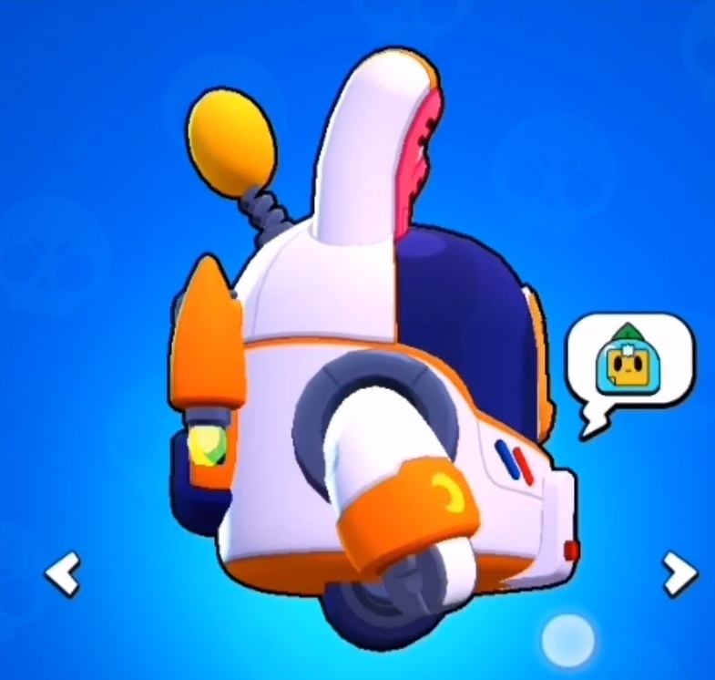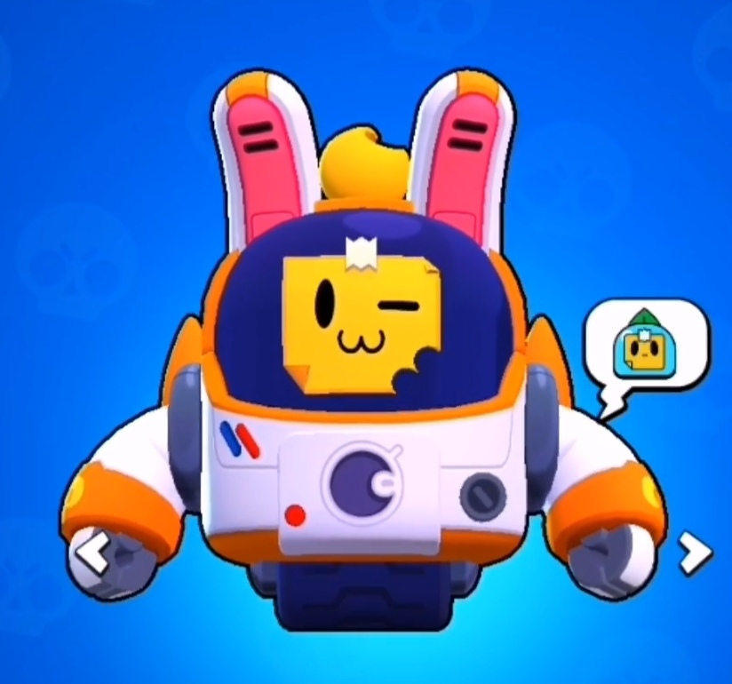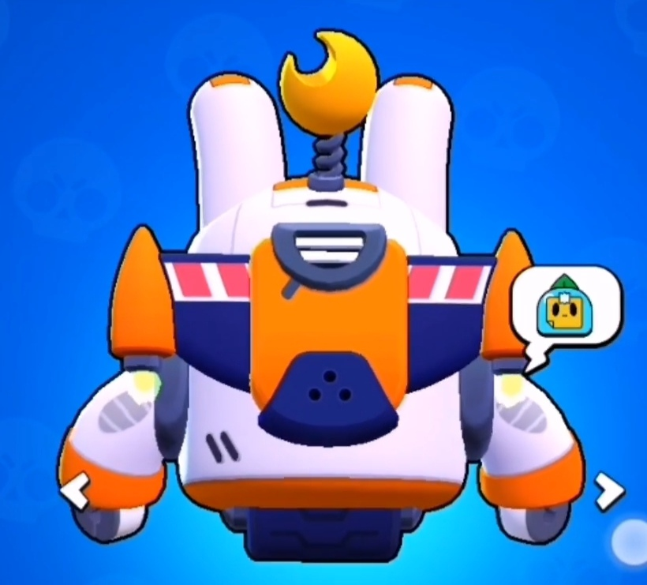
## Make my plan
I first raised the idea from a video([芽 * 了 你__bilibili](https://www.bilibili.com/video/BV1Cv411q73X/?spm_id_from=333.337.search-card.all.click&vd_source=28731c5b913c8f10e9ed59a378657331), Old虾), but I preferred to commit some changes based on it. 

The product in above video is far from perfect from my perspective, for the one in the video suffering from mismatched proportion. The acrylic cover is too high, and the size of emotion notes at the front is a bit strange. In one sentence, Old‘s work is excellent in making a controllable sprout just like a toy car, but in my work I would focus on rebuilding the "identical" sprout.

The propulsion system in the video is intriguing, and it truly was one of the key objectives of my plan. But later I had to somehow discard it. What a pity! For one thing, I could be hard for my to design a stabilization system that allow my sprout to move via merely one tire, or a set of concentric ones, given that the brawler in games only have such moving design. I had thought about buying one one the internet, however, this could involve endless debugging and, for what ever I searched, I had to enlarge the primary design to permit a space for a such system. Any way, the idea is attractive, but compromise had to be made with limited budget and time.

## Start with some drafts

I was not a student major in art or design or art, the only course I had that related to this project is CAD, an optional course when I still in material science. Luckily, clumsiness in drawing did not impair my workout a lot. Though the design draft is far from standard, clear and elegant, I  could still manage to figure out some design detail in following part. 

The main moving unit in sprout is its arms, joints need to be placed in both shoulder and wrist, the elbow joint is omitted.

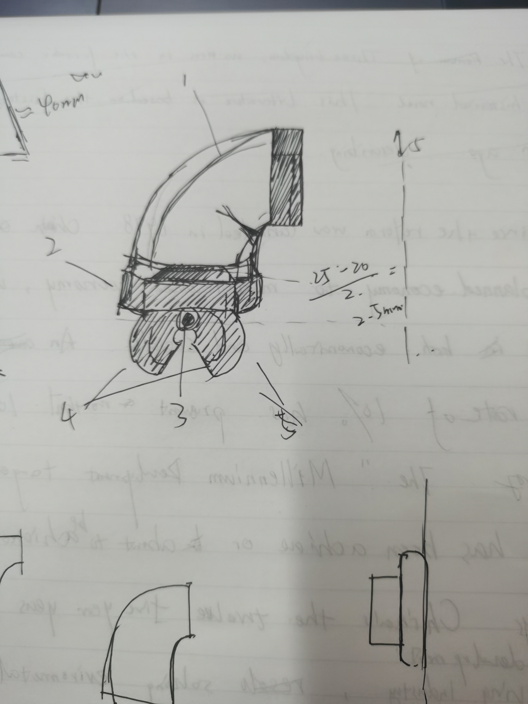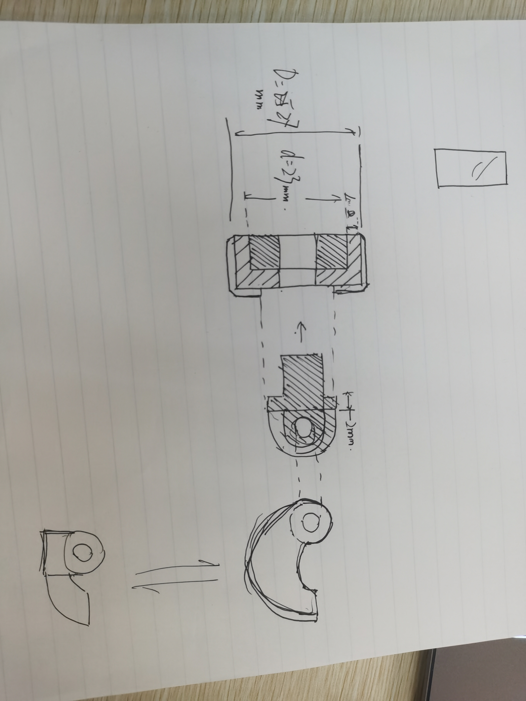

Above are part of draft I had drawn. Some are discarded while others are kept. It was after drawing those draft I realized that some of my objectives might be impractical. 

The final draft divide the model into several parts: The transparent covering, two ears, the antenna, the body part, two arms, the rocket backpack and the track. Next steps will be building the #D model of each part, and print them. After that wil be coloring, if things were to go smoothly.

## Modeling
> Now as a student in statistics, I am busy with tacking with various mathematical models, statistics models and especially machine-learning model. So glad I was to extend my model repository with 3D model in this project.

Building 3D models is relatively easy for my, just drawing, dragging and connecting. With powerful SolidWorks, I can rapidly build anything in my mind with half an hour. (At that 2022 summer, not now. I  almost forgot them :-(. ) It took only a week for me to finish the modeling of sprout. In program, I also color the components, to see if my work is similar to the one in games.

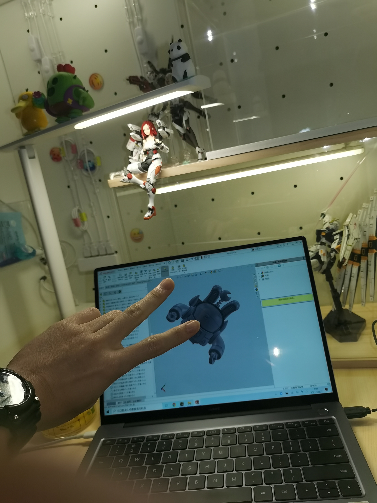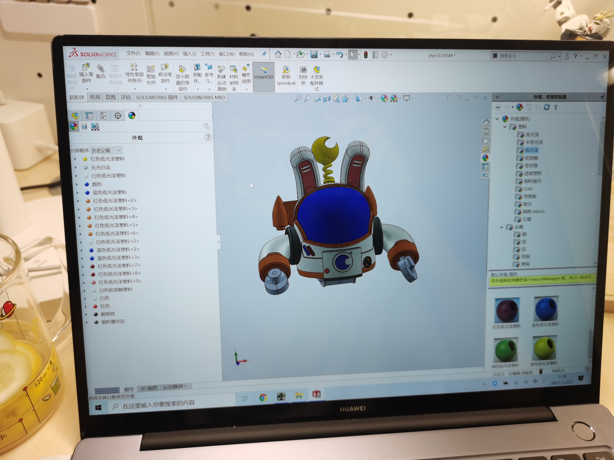

> Btw, as you can see the display case on my desk, I LOVE design the element on it. I update the layout nearly every half a year. Hope I have chance to share it with you in the future.

I can not  wait to 3D print my model once I complete the connection test!  *I was EXCITED to the point of insomnia. I have never feel like this even before final XD.*
## 3D printing
> If nothing ever tries to upset you, that's not how story tells.
> Unexpectedly as expected, I found the 3d print components cannot connect perfectly. The joining were of same radius, the printing precision was not that high. The arms can be inserted into body, but it can hardly be supported, hanging on each side. This was same for the rocket backpack, the backpack will simply fall off from the back.  

No doubt that remodeling is needed, fortunately this time only some modification.

Back to SolidWorks, I edited some parameters to ensure no more loose joints. Three days later, version 2 was successfuly bulit, and its arms, backpack and hands function normally.
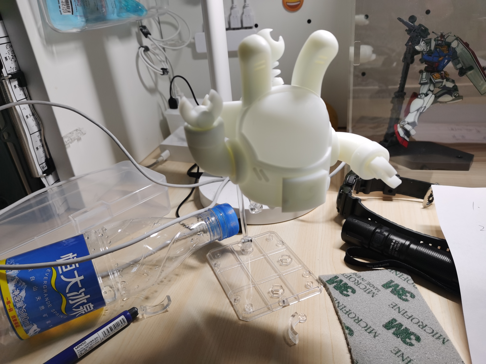

*Assemble for test. The model is support by a plastic frame.*

Then it will be last and the most significant step, coloring.

## Coloring

Coloring is somehow risky. A careless mistake can result in a black spot in white. At best I need to grind that paint, if possible, at worst I would need to reprint the component again. ~~Whenever I describe the difficulty, I am actually boasting XD.~~

The first procedure is spray coating. This is an essential step of coloring. The coating not only acts as a ground color, but also provide a base for the subsequent coloring. In simple words, the coating has a special chemical component, it can stick to the 3D print material more easily, and its surface is much more rough, provide more adhesion to normal paints.

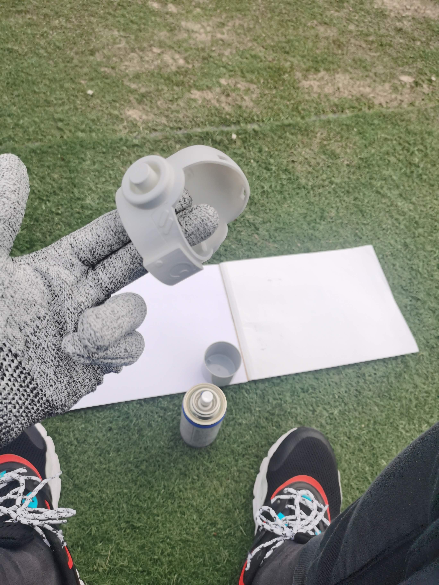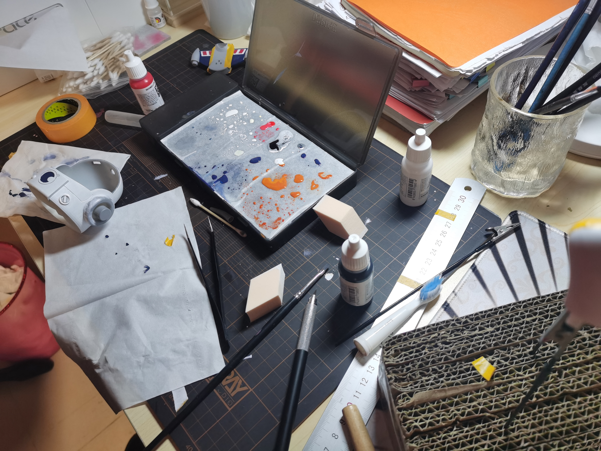

The second procedure is paint, with brushes. Here are a variety of coloring techinques: By using different types of brushes, lines, blocks and patterns are drawns. And for some color like deep blue, you need to repeat the procedure for several time until the color is uniform and clear. One requirement for such painting is to avoid brush strokes. You always need to pay attention the the edge of last strokes, and steady hands and a patient heart are always necessary. In addition, you can see a flesh-colored rhomboid in photos. It was actually a powder puff, which girls use when make up. But as it has a smooth and porous surface, it is surprisingly efficacious while painting in are large area. The color effect is extremely even.

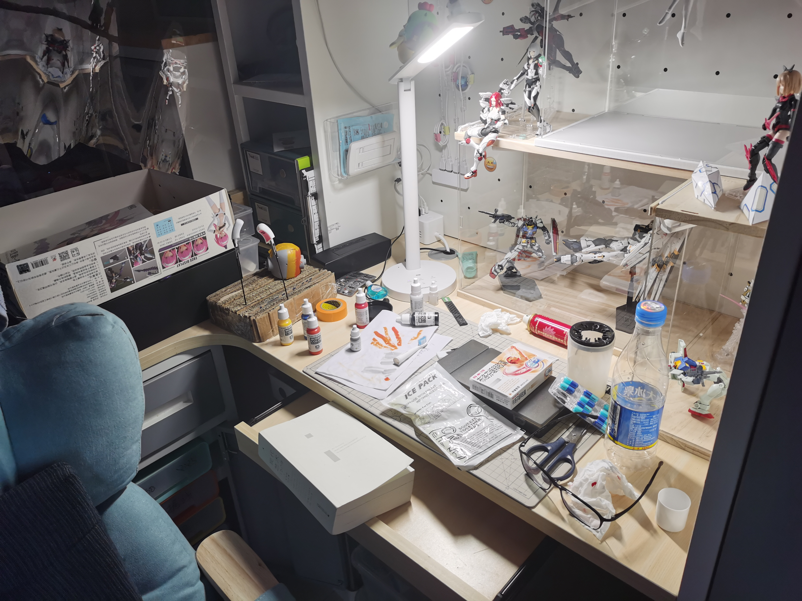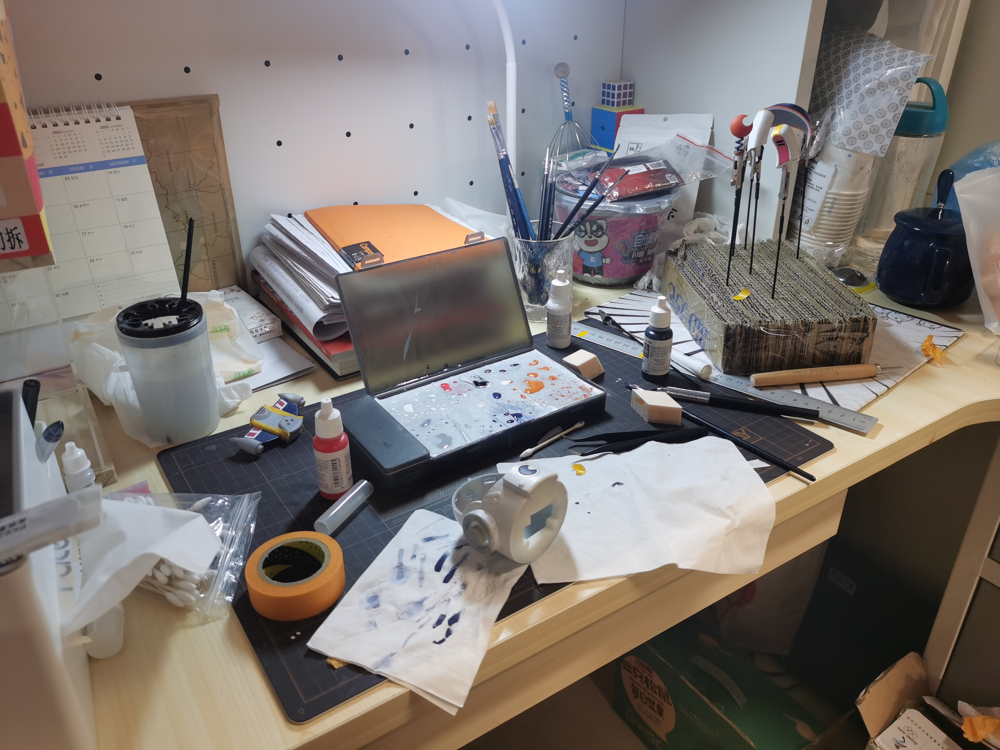

> Those work is painful for my, physically. When I was clycling to a open area for spray coating( the coating pain is a bit toxic), a accidentally fell from my bike, leaving my right wrist hurt for the upcoming month🤯. Every time I picked up the brushes, I had to bear the pain in the wrist. But compared to such pain, I am even more unwilling to delay the plan.

## Other work
### Apply the proctective coating
After the paint, a final layer of protective coating is required. It is much like a sandwich structure: the bottom layer is respionsive to stick to the material, the middle one contribute to color, and the upper layer protect them from abrasion.

They are basically three types of protective coating, considering their texture: matte, glossy and semi-glossy. For the blue windshield, I applied matte one, which made it more ensemble glass. For other part glossy one is used, for it is generally good-looking.

### Stand and interesting accessories

I choose a rectangular plastic  panels as the stand for sprout. The panel are perforate to enable inserting plastic sticks aiming for support. Both sides of the panels are wrapped with a thin PVC sheet, and there are patterns drawn on the top. The final result makes it look like a combat base, both fun an coooooool.

There are also some accessories, for example, the emote "red thumb", most outstanding one in BrawlStars is made with a message box. Placed precisely on the upper left of sprout, just like in games!

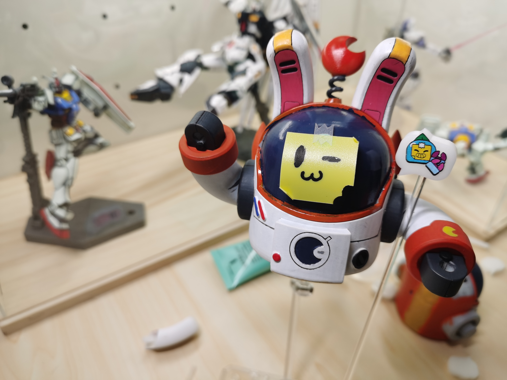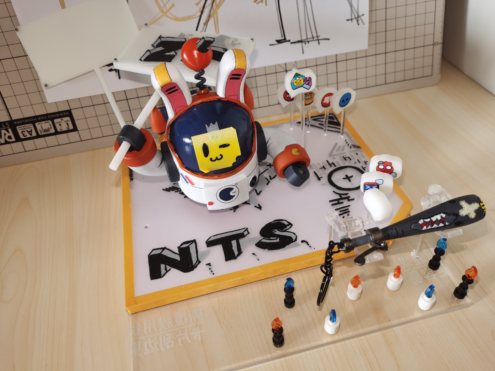

## Afterword

This was the second time to achieve my goal, started with mere simple idea. This project, together with previous music recording, is engaging and rewarding, where I explore a path other than my major, seeking for some meaning of my university life other than GPA. I will encourage you reader to pursuit the dream in your mind, whatever how impossible it may seem now. With simple but persistent planning and learning, your goal will gradually become within reach.\

